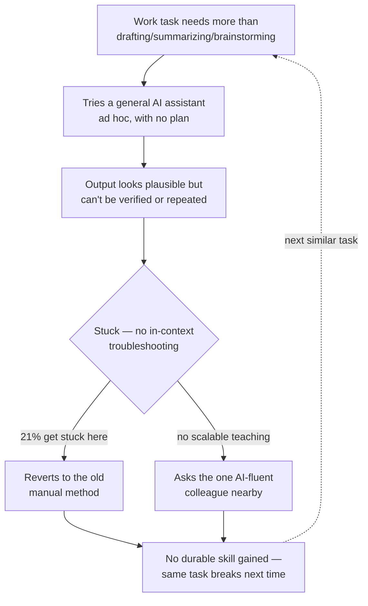
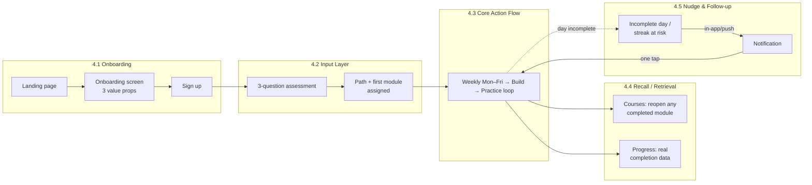
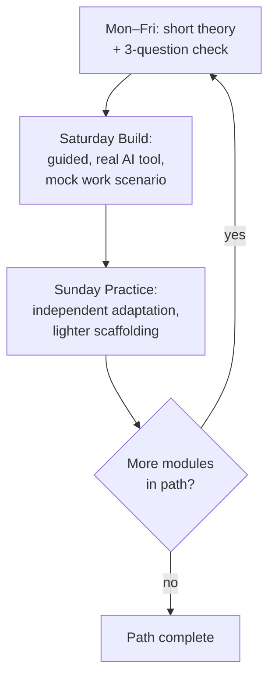
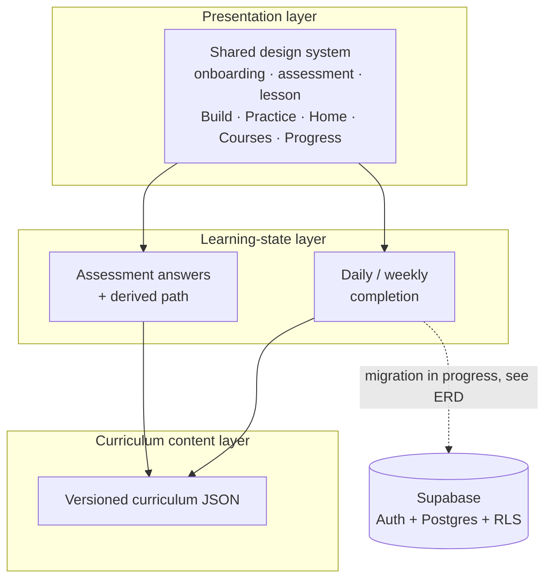

# PRODUCT REQUIREMENTS DOCUMENT

**Product Name:** Marg — an applied AI-skills path for non-technical professionals
**Prepared by:** Rochak Agarwal (Group 6, Cohort 8)
**Date:** August 22, 2026
**Primary source:** *G6 – Case Study 4: Learning Tech &amp; AI for the Next Generation of Professionals* (team research workbook — 18 tabs, cited by tab name throughout). Secondary sources cited inline; full list in **References**.

---

## 0. Document Overview

### 0.1 Purpose &amp; Scope

This document explains why non-technical professionals who already use AI daily still can't apply it to real work, and lays out Marg — a mobile-first, personalized learning path that replaces passive content with a weekly cycle of theory, guided build, and independent practice. It covers the problem (Sections 1–15) and the solution as it exists in the current build today (Sections 2–13, Solution Space).

### 0.2 Research Scope

The team combined:

- **Primary research** — a structured survey (15 questions across demographics, AI usage, barriers, learning behavior, and fears; *Consolidated Survey* tab) and individual discovery interviews/questions run by each of the 11 team members (*Discovery Questions*, *primary research* tabs), later merged into 6 validated themes (*THEMES* tab) and 190+ underlying hypotheses (*Hypothesis Consolidation* tab).
- **Secondary research** — WEF Future of Jobs, LinkedIn Skills, and OECD reporting on skill turnover; a 27-row competitor landscape spanning AI-native upskilling platforms, MOOCs, enterprise L&amp;D suites, India-specific workshop players, and informal channels (*Competitor Analysis*, *Comp. analysis metrics* tabs).
- **Target segment** — non-technical, cross-functional knowledge workers (Marketing, HR, Finance, Ops, Sales, Product, Founder, Legal, Support) at startups and SMEs, who already use ChatGPT/Gemini/Copilot/Claude for work but have no structured way to go further than drafting and brainstorming.

### 0.3 Confidence Tags

- **High confidence** — findings that converge across the survey, multiple independent discovery interviews, *and* secondary research (e.g., the practice gap).
- **Moderate confidence** — findings validated by the survey and interviews but not yet cross-checked against external reports (e.g., preferred learning format, time budget).
- **Emerging signal** — a single-source or thin-evidence finding flagged for further validation (e.g., the confidence-vs-skill distinction in Theme 6, tagged "Needs qualitative validation" in *THEMES*).

---

## 1. Problem Tension

### 1.1 Real User Scenario

Priya is a marketing manager at a 40-person startup. She uses ChatGPT daily — drafting social captions, summarizing customer calls, brainstorming campaign angles. Her manager asks her to "use AI to build a lightweight process" for triaging inbound customer feedback into themes her product team can act on. Priya opens ChatGPT, pastes in a spreadsheet of feedback, and gets a reasonable-looking summary. She has no way to tell if the categories are actually right, no idea how to make this repeatable next week without redoing the same manual copy-paste, and no one to check her work against. She closes the tab, does it manually in a spreadsheet instead, and tells her manager "I looked into it, it's tricky." This is not a one-off — it is the exact moment where daily AI *use* stops short of AI *capability* (Theme 2, *THEMES* tab, strongly validated; open-text responses to Q15 in *Consolidated Survey* echo the same "I don't know if I did it right" pattern).

### 1.2 Observable Breakdown in Current Process

The pattern repeats in a fixed order: (1) a work task shows up that goes beyond drafting/summarizing/brainstorming; (2) the professional tries a general AI assistant ad hoc, with no structure; (3) the output looks plausible but they can't verify it or extend it into a repeatable workflow; (4) they get stuck with no in-context way to troubleshoot (36% want a guide, *THEMES* Theme 3); (5) they revert to the old manual method or ask the one AI-fluent colleague nearby, which doesn't scale and teaches the asker nothing durable (*Competitor Analysis*, row 29). This is not a caring problem — respondents are not indifferent (only 9% cite employer pressure as their reason to improve; 54% are self-motivated, *Secondary Research Insights*). It is a systemic gap: every available option (YouTube, courses, the assistant itself) hands them information or a single answer, never a supervised rep at their own task with feedback on whether they got it right.

*The loop that repeats for every target user without an intervention — this is the exact loop Marg's weekly Build/Practice cycle (Solution Space §4) is designed to interrupt at step C/D.*

### 1.3 Evidence of Impact

- 33% of respondents don't know where to start with AI learning; YouTube is the top self-directed channel at 54% usage despite being unstructured (*THEMES* Theme 1; *Consolidated Survey* Q10).
- 34% cite lack of practice, 22% call existing learning too theoretical, 21% can't apply what they learned to work, and 75% say they'd prefer real-life challenges over more content (*THEMES* Theme 2 — the single most strongly validated theme in the research).
- 21% get stuck mid-task with no way forward; 36% explicitly want a step-by-step guide when they hit an error (*THEMES* Theme 3).
- Confidence in AI output accuracy averages 3.87/5, and roughly a third of even daily users remain "not confident" in their own AI ability (*THEMES* Theme 6; *Consolidated Survey* Q9).
- 40% want lessons in 5–10 minute chunks; 59% prefer small, achievable goals over long courses (*THEMES* Theme 5; *Consolidated Survey* Q11–Q12).

**Sources:** G6 Case Study 4 workbook — *THEMES*, *Consolidated Survey*, *Secondary Research Insights* tabs.

### 1.4 Why This Problem Matters Now

Two things changed recently. First, the ceiling moved: WEF projects 39% of workers' core skills will change by 2030, and LinkedIn estimates up to 70% of skills used in most jobs could shift in the same window — AI and technology literacy are now baseline expectations, not specialist skills (*Secondary Research Insights*). Second, the cost of giving personalized feedback — historically the reason applied practice was too expensive to offer at scale — has collapsed: an AI system can now review a learner's own draft, workflow, or output and give specific, contextual feedback for close to zero marginal cost (*Secondary Research Insights*, row on "the human feedback needed to build real skill was historically too costly — a constraint that only recently changed"). What was previously a people-scaling problem is now a product problem, and no major player has redesigned around that shift yet — most still sell content at scale, not feedback at scale.

| **Insight &amp; Conclusion.** This is a systemic gap, not a motivation gap: professionals want to improve (54% self-driven) and already use AI daily, but every learning path they can currently access ends at "understand a concept" or "watch someone else do it," never at "I did this myself, on my own work, and I know it was right." The AI feedback cost collapse means this gap is solvable now in a way it wasn't three years ago — that is the opening Marg is built for. |
| :------------------------------------------------------------------------------------------------------------------------------------------------------------------------------------------------------------------------------------------------------------------------------------------------------------------------------------------------------------------------------------------------------------------------------------------------------------------------------------- |

---

## 2. Broader Problem Statement

### 2.1 Industry-Level Problem

The same breakdown shows up across every function represented in the survey (Marketing, HR, Finance, Ops, Sales, Product, Founder, Legal, Support — *Consolidated Survey* Q1), not just Priya's. The tools people are handed were built for two different jobs: traditional e-learning platforms (Coursera, LinkedIn Learning, Udemy) were built to distribute video content at scale, and general AI assistants (ChatGPT, Claude, Gemini) were built to answer a question in the moment. Neither was built to run a learner through a structured cycle of "try it on your own work → get feedback → try again." Twenty-seven competitor and adjacent-category profiles were mapped, and the same shape recurs: strong on beginner-friendliness (15/27 rated strong) and on non-technical accessibility (18/27), but weak on role-based personalization (4/27), real-work application (7/27), and AI coaching / adaptive feedback (4/27) (*Comp. analysis metrics* tab).

### 2.2 User-Level Problem

Faced with a real task and no verified path forward, the target user spends most of their time either consuming more content (another YouTube video, another course module) or falling back to the manual, non-AI way of doing the task — both of which feel safer than shipping something they can't validate. They prioritize the manual fallback over the "proper" AI-assisted approach because manual work has a known, bounded failure mode, while an unverified AI output could be wrong in a way they can't detect (Theme 6, *THEMES*; row 30, *Competitor Analysis* — "bring-your-own-AI" usage is described as "invisible, unmeasured and off the record, so skill growth is uneven").

### 2.3 Systemic Gap in Existing Solutions

Every existing solution — from free YouTube tutorials to $2,000+ executive-education cohorts — shares one design assumption: that the learner's job is to consume correct information, and capability will follow automatically. In practice that assumption breaks down exactly at the "now do it yourself, on your own work" step, which almost none of the 27 mapped competitors treat as the product's core loop (real-work application is present in only 7/27; AI coaching that adapts to the learner's actual mistakes is present in only 4/27 — *Comp. analysis metrics*). The systemic gap is a missing **feedback loop tied to the learner's own work**, not a missing content library.

| **Insight &amp; Conclusion.** Every competitor assumes information transfer is the product. The one thing none of them do at scale is close the loop — task, attempt, feedback, retry — inside the learner's actual context. That loop, not another course catalog, is the white space. |
| :--------------------------------------------------------------------------------------------------------------------------------------------------------------------------------------------------------------------------------------------------------------------------------------- |

---

## 3. Context

### 3.1 User Environment

The target user typically works inside a small, resource-constrained team: a startup or SME function of 1–8 people with no dedicated L&amp;D budget, no internal AI champion beyond "the one coworker who gets it" (*Competitor Analysis*, row 29), and no formal onboarding for AI tools beyond whatever their employer's IT policy allows. They have access to a free or personal-tier AI assistant subscription but no enterprise governance, curated prompt library, or in-house training.

### 3.2 User Reality

Their week is split across their actual job function (the majority of their time), ad hoc AI experimentation squeezed into small gaps, and whatever learning they can fit in outside of both. Realistically they can commit under 30 minutes a week to structured learning (*Consolidated Survey* Q11: most responses cluster at "under 15 mins" to "15–30 mins"). When time runs short, the first thing to go is the learning — not because it isn't valued, but because it isn't tied to an urgent deliverable the way their actual job tasks are.

### 3.3 Multi-Channel Landscape

A single "I need to use AI for X" moment can move across four or five disconnected channels: a general AI assistant (for the task itself), YouTube or a newsletter (to figure out how), a colleague's Slack DM (when stuck), and possibly a paid course (for structured but generic content) — none of which know about the others, or about the specific task the person is actually trying to finish. This fragmentation is why the same task can take a learner through five tools and still leave them unsure whether they did it right.

| **Insight &amp; Conclusion.** Given a resourceless environment, under-30-minutes-a-week reality, and a five-channel path to get anything done, Marg has to work as one place that both teaches and lets the learner practice — anything that adds a channel (a separate community, a separate tool to master) will lose to inertia. |
| :----------------------------------------------------------------------------------------------------------------------------------------------------------------------------------------------------------------------------------------------------------------------------------------------------------------------------------- |

---

## 4. Target User Definition

### 4.1 Segment Definition

Marg's primary segment is not "professionals" broadly — it is the specific slice of daily AI users who have crossed from curiosity into habitual use (they use an AI tool at least a few times a week — *Consolidated Survey* Q5) but have never gone past drafting, summarizing, or brainstorming (*Consolidated Survey* Q6) into a multi-step or role-specific workflow. They are early-to-mid career (1–7 years' experience is the modal band in the survey), work at a startup or SME (versus a large enterprise with a formal L&amp;D function), and self-identify as "not technical" — meaning they've never written code, don't know what an API is, and interpret a failed AI attempt as evidence the tool (or they) aren't ready for it, rather than as a normal step in learning it.

### 4.2 User Responsibilities

Beyond the target problem, this user owns their full function's day-to-day output — campaigns, hiring, reconciliations, tickets, deals, depending on role — plus whatever ad hoc AI experimentation they do on the side. The most time-constrained responsibility is always their core job function; anything AI-related, including learning, is squeezed around it, not scheduled for it.

### 4.3 Behavioural Characteristics of Target Users

- **They already have a daily AI habit** — this rules out any product that starts from "here's what AI is." They need to start from where they already are.
- **They interpret confusion as personal inadequacy, not a normal learning step** (Theme 6, *THEMES*) — this rules out unguided, sink-or-swim exercises with no in-context explanation of *why* something went wrong.
- **They will not commit to long-form content** (40% want 5–10 minute units) — this rules out lecture-style courses or multi-hour bootcamps as the core format.
- **They abandon tools that don't show progress toward something they'll actually use at work** (75% want real-life challenges) — this rules out generic, decontextualized exercises (e.g., "summarize this Wikipedia article") as the primary practice format.

| **Insight &amp; Conclusion.** The trait that would kill the product if ignored is the confidence-as-inadequacy pattern: if a learner hits friction and reads it as "I'm not cut out for this" rather than "this is the next thing to learn," they will not come back. Every guided exercise has to normalize getting it wrong and show the learner exactly what to do next. |
| :--------------------------------------------------------------------------------------------------------------------------------------------------------------------------------------------------------------------------------------------------------------------------------------------------------------------------------------------------------------------------- |

---

## 5. Problem Space Context

### 5.1 Current User Behaviour

Relevant activity starts inside the general AI assistant itself, mid-task, with no plan — the user opens ChatGPT because a task is due, not because they intended to learn something. It never reaches a system that tracks what they attempted, what worked, or what they should try next; the assistant itself has no memory of the learner's skill trajectory, and no other tool in their stack is watching either.

### 5.2 Management Practices

The default "system" is entirely informal: bookmark a YouTube video for later, ask the one colleague who's good at this, or just do the task manually. These workarounds are reactive (triggered by a stuck moment, not planned) and break down the moment the task is even slightly different from what the video or the colleague covered — because none of them adapt to the learner's specific role or the specific task in front of them.

---

## 6. Business Impact of the Problem

Using the survey and secondary evidence as inputs, a rough estimate for a single mid-size company (50 non-technical employees) follows. This is directional, not audited — it exists to show the cost is large enough to justify building something new, not to be a precise ROI model.

- Assume each of the 50 employees hits the "AI task beyond drafting" wall roughly once a week (consistent with daily-use-but-can't-extend behavior, Theme 2).
- Each time it happens, they either (a) revert to the manual method, costing an estimated 1–2 hours of otherwise AI-avoidable manual work, or (b) ship an unverified AI output that a colleague later has to check and fix — a pattern explicitly named "workslop" in the discovery interviews (*Hypothesis Consolidation*, item 41), costing a comparable 1–2 hours of downstream rework.
- At a blended fully-loaded cost of ~$35/hour and 1.5 hours lost per employee per week: 50 × 1.5 ×$35 = **$2,625/week**, or roughly **$136,000/year** for a single 50-person company in avoidable rework and unrealized productivity.
- Scaled qualitatively: WEF's 39%-of-core-skills-changing-by-2030 figure and LinkedIn's 70%-of-skills-shifting figure both point to this cost recurring, not shrinking, across the entire non-technical workforce as AI adoption deepens (*Secondary Research Insights*).

**Sources:** *THEMES*, *Hypothesis Consolidation* (G6 workbook); WEF Future of Jobs Report; LinkedIn Skills on the Rise (cited in *Secondary Research Insights* tab).

| **Insight &amp; Conclusion.** Even a conservative, single-company estimate lands above $100K/year in avoidable cost — multiplied across every startup and SME with non-technical staff using AI daily, this is not a marginal problem. It is urgent enough to justify a dedicated product rather than waiting for existing content platforms to add a practice layer. |
| :--------------------------------------------------------------------------------------------------------------------------------------------------------------------------------------------------------------------------------------------------------------------------------------------------------------------------------------------------------------------- |

---

## 7. Existing Ecosystem

### 7.1 The Real Existing Solutions

The true baseline competitor is inaction: postponing learning entirely and continuing to work the old way until a task forces a one-off video or article (*Competitor Analysis*, row 28 — "the true default competitor and the hardest to displace, because it has zero switching cost"). Just below that, the most common "proper" workaround is asking the one AI-fluent colleague — fast and contextual, but unscalable and teaches the asker nothing durable (row 29). Technical users occasionally build their own no-code automation (via Zapier/Make/n8n tutorials) rather than buy a course, but this path assumes a comfort with APIs and permissions the target segment explicitly lacks (Section 4.1).

### 7.2 Tool Landscape

| Tier                             | Examples                                  | Assumes user has…                                  | Fit for target user                                                      |
| :-------------------------------- | :----------------------------------------- | :-------------------------------------------------- | :------------------------------------------------------------------------ |
| Premium executive education      | MIT Sloan, Stanford, Great Learning       | $2,500+ budget, multi-week time commitment         | Poor — cost and time both fail the segment                               |
| AI-native professional platforms | Mindstone, Section AI, Superhuman Academy | Employer-funded seat or high personal motivation   | Partial — closest in spirit, weak on real-work application (Section 2.3) |
| Mobile habit-first apps          | Coursiv, Iro AI, Duolingo-style apps      | Tolerance for generic, gamified exercises          | Partial — nails the habit mechanic, not the work-relevance               |
| MOOCs / content libraries        | Coursera, Udemy, LinkedIn Learning        | High self-direction to choose and sequence content | Poor — recreates "what do I learn next" problem                          |
| India-native workshop model      | GrowthSchool, Be10x, Outskill             | Tolerance for one-off, upsell-heavy live sessions  | Poor — a single workshop can't build durable capability                  |
| Free/informal channels           | YouTube, Reddit, newsletters              | Time to search and synthesize themselves           | Weak — the current default, no structure or feedback                     |

*(Source: Competitor Analysis, Comp. analysis metrics tabs)*

### 7.3 The Actual Usage Pattern

Week one of a new tool typically goes well: the learner completes the first module or workshop and feels momentum. By weeks two–three, the content stops connecting to whatever specific task is in front of them that week, and completion drops. By week four, most have reverted to their old workaround (ad hoc AI use, or asking a colleague), with the paid course or app left unopened — the same pattern the case study workbook's key-insights summary describes as "India has almost no 'Duolingo for AI' — it has workshop factories instead" (*Competitor Analysis*, row 35).

### 7.4 Architectural Ceilings

- **Content-at-scale economics** — real, structural: it is cheaper to produce a video once and sell it many times than to review each learner's individual work, so most platforms are built around content, not feedback. This ceiling is what the AI-feedback-cost collapse (Section 1.4) now removes.
- **Vendor-ecosystem lock-in** — mostly an unsolved product gap, not a technical limit: OpenAI, Anthropic, Google, and Microsoft academies each teach their own tool, leaving the learner to build a cross-tool roadmap themselves (*Competitor Analysis*, row 12).
- **Certification without verification** — an unsolved product gap: 15/27 competitors offer a certificate, but a certificate proves completion, not that the learner could independently repeat the skill on a new task (*Comp. analysis metrics*).

| **Insight &amp; Conclusion.** The white space every existing tool or workaround shares is the same one identified in Section 2.3: nobody has closed the loop from "learn a concept" to "prove you can do it on your own work, with feedback on whether you got it right." That loop is Marg's opening. |
| :------------------------------------------------------------------------------------------------------------------------------------------------------------------------------------------------------------------------------------------------------------------------------------------------------ |

---

## 8. Primary Research

### 8.1 Primary Research Plan

The team ran two parallel primary research tracks. First, an 11-person discovery-question exercise: each team member independently generated their own research questions (*Discovery Questions* tab) before comparing notes, deliberately avoiding groupthink on what the "real" problem was. Second, a structured 15-question survey (*Consolidated Survey* tab) covering demographics, current AI usage, barriers, learning behavior, and fears, distributed to non-technical professionals across functions and company sizes to avoid over-indexing on any single role. Known bias: the sample skews toward each team member's own professional network, which likely over-represents startup and tech-adjacent employees relative to traditional enterprises or government.

### 8.2 Primary Research Findings

The 11 independent discovery tracks converged, almost without coordination, on the same underlying pattern: this is a **practice-and-feedback gap**, not a knowledge, motivation, or tooling gap. That convergence — 190+ individually written hypotheses collapsing into six shared themes (*Hypothesis Consolidation*, *THEMES* tabs) — is stronger evidence than any single interview, because it wasn't the product of one person's framing. The clearest say/do gap: respondents describe themselves as self-motivated to improve (54%, not employer pressure) yet the same group defaults to unstructured, low-accountability channels like YouTube (54% usage) when actually trying to learn — motivation exists, but it isn't being captured by any available structured option.

**Sources:** G6 Case Study 4 workbook — *Discovery Questions*, *Hypothesis Consolidation*, *THEMES*, *Consolidated Survey* tabs.

| **Insight &amp; Conclusion.** The strongest pattern is the practice gap's independent replication across 11 uncoordinated researchers. The clearest gap in who we talked to is company type — more validation is needed from large-enterprise non-technical staff, whose L&amp;D access and incentives may differ meaningfully from the startup/SME-heavy sample. |
| :----------------------------------------------------------------------------------------------------------------------------------------------------------------------------------------------------------------------------------------------------------------------------------------------------------------------------------------------------------------- |

---

## 9. Secondary Research

The market context is a fast-moving, well-documented skills shift: WEF projects 39% of workers' core skills will change by 2030, and AI/big-data literacy is among the fastest-growing skill categories; LinkedIn estimates up to 70% of the skills used in most jobs could shift in the same window; OECD's 2026 outlook describes general AI understanding as increasingly required alongside specialist skills, not instead of them (*Secondary Research Insights* tab). The competitive market itself is large and fragmented rather than consolidated — 27 distinct players and categories were mapped, spanning $0-free tools to$16,000+ enterprise bootcamps, with no single dominant "Duolingo for AI" player identified globally or in India specifically (*Competitor Analysis*). The most common complaint across reviewed platforms (Trustpilot, App Store) is not quality but a mismatch between marketed depth and delivered depth — aggressive upsells from cheap intro workshops (GrowthSchool, Be10x, Coursiv) and generic content that doesn't transfer to the learner's actual role.

**Sources:** WEF Future of Jobs Report; LinkedIn Skills on the Rise; OECD 2026 skills outlook (all cited in *Secondary Research Insights* tab); Trustpilot/App Store review excerpts (*Competitor Analysis* tab).

| **Insight &amp; Conclusion.** Timing is right: the skills shift is large, fast, and already underway per three independent macro reports, and no competitor has consolidated the category around a practice-first model yet — this is a genuine window, not a saturated market. |
| :------------------------------------------------------------------------------------------------------------------------------------------------------------------------------------------------------------------------------------------------------------------------------- |

---

## 10. Competitor Analysis

| Competitor                               | Good at                                                               | Fails target user by                                                                                    |
| :---------------------------------------- | :--------------------------------------------------------------------- | :------------------------------------------------------------------------------------------------------- |
| **Mindstone**                            | Continuous exposure, browser-extension integration with real AI tools | Little evidence of a portable, independently assessed progression from concept to workplace project     |
| **Section AI**                           | Role-specific courses, coaching, certification                        | Short-format workshops; limited visibility into guided-exercise-to-independent-work progression         |
| **Coursiv**                              | Low-friction mobile onboarding, habit mechanics                       | Trades depth for breadth; aggressive upsells; unclear employer recognition or complex-workflow transfer |
| **Superhuman Academy**                   | Free, 5-minute lessons, real-tool practice, proficiency certification | Catalog still developing; limited independent evidence of long-term capability gain                     |
| **Coursera / Udemy / LinkedIn Learning** | Huge catalog, brand trust, India-scale reach                          | Recreates the "what do I learn next" problem; little role-specific feedback or accountability           |

*(Full 27-row matrix in Competitor Analysis / Comp. analysis metrics tabs.)*

The shared weakness across all 27 profiles: strong on beginner accessibility (15/27) and content breadth, weak on role-based personalization (4/27), real-work application (7/27), and adaptive AI coaching (4/27) — exactly the combination Marg is built around (*Comp. analysis metrics*).

**Sources:** *Competitor Analysis*, *Comp. analysis metrics* tabs.

| **Insight &amp; Conclusion.** Every competitor's shared weakness is the same missing feedback loop identified in Sections 2.3 and 7.4. That is Marg's best — and only defensible — opening; competing on content breadth alone would be a losing fight against platforms with far larger catalogs. |
| :-------------------------------------------------------------------------------------------------------------------------------------------------------------------------------------------------------------------------------------------------------------------------------------------------- |

---

## 11. Problem Clustering

1. **Practice gap** (most common, most damaging) — learners consume content but never attempt real work with feedback (Theme 2, strongly validated).
2. **Direction gap** — learners don't know what to learn next among fragmented options (Theme 1, validated).
3. **Troubleshooting gap** — learners get stuck on an unexpected result with no guide (Theme 3, validated).
4. **Confidence/self-assessment gap** — learners interpret difficulty as personal inadequacy and can't self-rate their own level (Theme 6, emerging signal).
5. **Time/format mismatch** — existing content doesn't fit a sub-30-minute weekly budget (Theme 5, moderately validated).

**Source:** *THEMES* tab.

| **Insight &amp; Conclusion.** The practice gap is the root cause; the direction gap, troubleshooting gap, and confidence gap are downstream symptoms of the same missing loop — a learner who is regularly practicing on real tasks with feedback is, by construction, told what's next, coached through being stuck, and shown proof they can do it. Solving the practice gap collapses the other three. |
| :--------------------------------------------------------------------------------------------------------------------------------------------------------------------------------------------------------------------------------------------------------------------------------------------------------------------------------------------------------------------------------------------------------- |

---

## 12. Problem Prioritisation

| #   | Problem                        | Frequency                                     | Severity                               | Priority                                           |
| :--- | :------------------------------ | :--------------------------------------------- | :-------------------------------------- | :-------------------------------------------------- |
| 1   | Practice gap                   | Weekly+ (near-universal among daily AI users) | High — blocks all real capability gain | **High — primary focus**                           |
| 2   | Direction gap                  | Constant background friction                  | Moderate                               | Addressed as a byproduct of #1 (assessment + path) |
| 3   | Troubleshooting gap            | Every stuck moment (21%)                      | Moderate–High                          | Addressed as a byproduct of #1 (in-loop guidance)  |
| 4   | Confidence/self-assessment gap | Ongoing                                       | High for retention                     | Monitored, not solved directly in MVP              |
| 5   | Time/format mismatch           | Constant constraint                           | Moderate                               | Design constraint on #1, not solved separately     |

---

## 13. Prioritisation Rationale

The practice gap is more urgent and valuable than the others because it is the root cause (Section 11) and the one existing solutions have structurally avoided (Section 2.3, 7.4) — largely because giving individual feedback used to be too expensive, a constraint that has now genuinely lifted (Section 1.4). Direction and troubleshooting are treated as consequences to be solved as a side effect of a well-built practice loop, not as separate product surfaces, to avoid building three disconnected features. The trade-off: Marg is not attempting to be the definitive content library or the most gamified habit app on day one — those are the current strengths of large incumbents (Coursera's catalog, Duolingo's habit mechanic) that would be expensive and slow to out-build directly.

| **Insight &amp; Conclusion.** The practice gap is the right problem at the right time: it's the most frequent, most costly, and most structurally avoided by every existing option — and the one blocker (feedback cost) that made it unsolvable has just been removed. |
| :----------------------------------------------------------------------------------------------------------------------------------------------------------------------------------------------------------------------------------------------------------------------- |

---

## 14. Narrowed Problem Statement

Non-technical professionals at startups and SMEs already use AI tools daily for drafting, summarizing, and brainstorming, but stall the first time a real work task asks for more — a multi-step workflow, an unfamiliar dataset, an ambiguous ask from their role — because every learning option available to them (general AI assistants, video content, courses, colleagues) hands them information or a single answer, never a structured rep on their own work with feedback on whether they got it right. This is not a motivation problem — 54% are self-driven to improve — and it is not solved by more content; it persists because giving individualized feedback at scale was, until recently, too expensive for any platform to build around, so every competitor still optimizes for content delivery instead. As a result, even among daily AI users, roughly a third remain unconfident in their own ability, and that gap does not close on its own.

---

## 15. Key Assumptions

- **A1 (highest risk):** A structured weekly cycle of theory → guided build → independent practice with feedback will move self-reported and demonstrated confidence measurably within 30 days, for a learner with under 30 minutes/week to give. If this is false — if learners disengage before the loop closes even once — the whole model breaks. This is the first thing to test.
- **A2:** Personalizing the path via a short assessment (role/context + prior build experience) is enough signal to route learners correctly, without a longer diagnostic.
- **A3:** Learners will trust and act on feedback about their own AI output even without a human reviewer, as long as it's specific and tied to their actual attempt.
- **A4:** The startup/SME segment sampled in our research generalizes to non-technical professionals at larger enterprises, who were underrepresented in our sample (Section 8.1 bias note).

**Sources:** *THEMES*, *Hypothesis Consolidation* tabs.

| **Insight &amp; Conclusion.** A1 is the assumption that breaks everything else if wrong — it is tested first, via the 30-day activation and completion metrics in Section 11 (Solution Space). |
| :---------------------------------------------------------------------------------------------------------------------------------------------------------------------------------------------- |

---

# Solution Space

## 2. Product Concept

Marg is a mobile-first, personalized learning path that replaces passive AI content with a weekly practice loop: five short daily lessons (Monday–Friday), a guided **Build** exercise using a real AI tool against a realistic (mock) work scenario (Saturday), and an independent **Practice** adaptation the learner completes on their own (Sunday). A three-question assessment routes each learner into a basic or advanced path and picks their first applied module based on the type of work they actually do. The single biggest difference from existing options: every week ends with the learner having *produced something on a real task*, not just having watched or read something.

| Old way (existing platforms)         | Marg                                                                |
| :------------------------------------ | :------------------------------------------------------------------- |
| Watch a video, take a quiz on recall | Attempt a real task, get feedback on the attempt                    |
| One generic curriculum for everyone  | Path personalized by role and prior build experience                |
| Long-form courses (hours)            | 5–10 minute weekday units + one weekly build/practice session       |
| Certificate on completion            | Demonstrated capability on a task resembling the learner's own work |

| **Insight &amp; Conclusion.** Marg beats existing options for this exact user because it is the only one in the mapped landscape that treats "prove you can do it yourself" as the product, not an afterthought — directly answering the narrowed problem statement in Section 14. |
| :---------------------------------------------------------------------------------------------------------------------------------------------------------------------------------------------------------------------------------------------------------------------------------- |

## 3. Primary User Persona

**Priya, 29, Marketing Manager, 40-person B2B SaaS startup.**
Goal: be seen as the person on her team who can actually *do things* with AI, not just talk about it. Frustration: she uses ChatGPT daily but freezes the moment a task needs more than one step, because she has no way to check if she's doing it right and no time for a multi-hour course. Tools she already uses: ChatGPT (daily), a bit of Notion, occasional YouTube tutorials when stuck. What she needs most, no matter what else changes: a fast, low-stakes way to know "did I actually get that right?" — without exposing real company data.

| **Insight &amp; Conclusion.** The one need Marg must protect no matter what: a safe, low-stakes way to find out if an attempt was correct. Lose that, and Priya reverts to the manual fallback described in Section 1.1. |
| :------------------------------------------------------------------------------------------------------------------------------------------------------------------------------------------------------------------------ |

## 4. Product Flow

*One diagram, five stages — matches the 4.1–4.5 subsections below one-to-one, showing how a single learner moves through the product and where the nudge loop re-enters the core action flow.*

### 4.1 Onboarding Flow

A first-time visitor lands on the marketing page, moves into a single onboarding screen that frames Marg as "a learning path, not another chatbot" with three value props (10-minute steps, a live playground, progress that adds up), then signs up. No account setup beyond name/email/Google OAuth is required before the assessment — value (a personalized path) is shown within the first two minutes, before any content commitment.

### 4.2 Input Layer

Input comes through three channels today: (1) the three-question assessment (applied-context type of work, prior build experience, and whether they've gone beyond drafting), which sets the learner's path; (2) daily three-question comprehension checks at the end of each Monday–Friday lesson; (3) the Saturday Build and Sunday Practice submissions, where the learner pastes or describes their own AI attempt against a guided prompt. All are stored against the learner's progress record and used to compute real course/progress statistics — no mock data is shown in production.

### 4.3 Core Action Flow

The action a learner repeats most often is the daily lesson: open today's unit, read a short theory section (system does this automatically — renders the day's content from the curriculum), answer a three-question check (learner confirms understanding), and see immediate right/wrong feedback with an explanation (system does this automatically). Weekly, the same loop scales up to Saturday Build (guided, step-by-step, using a real AI tool) and Sunday Practice (the learner adapts the same skill independently, with a completion check).

*The weekly loop is the product's one repeated action — every other screen (Home, Courses, Progress) exists to launch, resume, or reflect this cycle back to the learner.*

### 4.4 Recall or Retrieval Flow

Before attempting a similar task again at work, a learner can return to Courses to reopen any completed module and its Build/Practice exercise, or check Progress to see exactly which modules and skills they've completed — answering "have I actually done this before, and did I get it right?" in a few taps.

### 4.5 Nudge and Follow-Up Flow

A daily-lesson streak and an in-app notification are the current nudge mechanism (`app/app/notifications`), triggered when a learner has an incomplete day or is at risk of breaking a streak. Per the product's existing decision on channel, nudges ship as in-app/push notifications at launch, not email or SMS. In one tap, the nudge opens directly into that day's pending lesson.

| **Insight &amp; Conclusion.** The step that still asks too much of the user today is Sunday Practice — it is the least scaffolded step in the loop, closest to an unguided exercise. It is kept intentionally lighter than Saturday Build so the learner practices without hand-holding at least once a week, but it is the first place to add adaptive hints if drop-off data shows it's where learners stall. |
| :--------------------------------------------------------------------------------------------------------------------------------------------------------------------------------------------------------------------------------------------------------------------------------------------------------------------------------------------------------------------------------------------------------------- |

## 5. Workflow Mapping — Before and After

| Before Marg                                                                                                | With Marg                                                                                                                                |
| :---------------------------------------------------------------------------------------------------------- | :---------------------------------------------------------------------------------------------------------------------------------------- |
| Priya hits a multi-step task, opens ChatGPT with no plan, gets a plausible-looking output she can't verify | Priya's path already covered a Build exercise close to this exact task type; she recognizes the structure and applies it with confidence |
| Stuck moment → reverts to manual spreadsheet work or interrupts a colleague                                | Stuck moment → in-lesson guidance and a completion check tell her exactly what to fix                                                    |
| No record of what she's actually capable of; has to re-prove herself every time                            | Progress screen shows real, completed modules and Build/Practice history she can point to                                                |

| **Insight &amp; Conclusion.** The biggest saving is trust, not raw time: Priya stops silently reverting to manual work (Section 6's ~1.5 hrs/week/employee estimate) because she now has a verified, repeatable reference for how to do the task correctly. |
| :----------------------------------------------------------------------------------------------------------------------------------------------------------------------------------------------------------------------------------------------------------- |

## 6. Platform Architecture

Marg is a single Next.js web application (mobile-first, responsive to desktop) with three layers: a curriculum content layer (versioned JSON generated from source content, currently local to the repo), a learning-state layer (assessment answers, derived path, and daily/weekly completion, currently client-side and being migrated to Supabase — see the ERD), and a presentation layer built from one shared design system (see Design.md) so every screen — onboarding, assessment, daily lesson, Build, Practice, Home, Courses, Progress — looks and behaves like one product. The permanent constraint: no in-product execution of the learner's AI workflow and no upload of real workplace data (privacy and scope decisions carried from the outset, see ERD Section on non-goals) — all Build/Practice exercises use mock scenarios by design, which shapes every exercise to be realistic-but-safe rather than "connect your real tools."

*Today, the state layer is client-side only (`localStorage`); the dotted line is the one architectural change in flight — see `ERD.md` §4–§8 for the target state and migration phases.*

| **Insight &amp; Conclusion.** The permanent constraint — no real workplace data in the product — is designed with, not against: it's exactly why Marg can promise a "safe, low-stakes" practice environment (Section 3's persona insight) without needing enterprise data-security review to launch. |
| :---------------------------------------------------------------------------------------------------------------------------------------------------------------------------------------------------------------------------------------------------------------------------------------------------- |

## 7. Moonshot

The bigger version of Marg connects directly to a learner's actual (permissioned) workplace tools — their real inbox, real feedback tickets, real docs — so Build and Practice exercises run on the learner's genuine work instead of a realistic mock scenario, with an AI coach that reviews the *real* output and tracks capability growth over time, visible to both the learner and (opt-in) their manager. This solves the "does this actually transfer to my job" doubt that mock scenarios can't fully remove. It isn't buildable yet because it requires real data-handling, permissioning, and security review that the current MVP explicitly avoids (Section 6), and because it should only be built once the mock-scenario version has proven the core practice-and-feedback loop actually works.

| **Insight &amp; Conclusion.** The moonshot unlocks provable, on-the-job transfer instead of simulated transfer — worth waiting for because doing it before validating the core loop would mean building expensive data infrastructure for a hypothesis that hasn't yet been confirmed at the small, safe scale. |
| :--------------------------------------------------------------------------------------------------------------------------------------------------------------------------------------------------------------------------------------------------------------------------------------------------------------- |

## 8. User Stories

**Getting started**

- As a new learner, I want a 3-question assessment, so that I get a path matched to my role and experience instead of a generic course. *(Done = path and first module assigned; fixes the direction gap, Theme 1.)*
- As a returning signed-out learner with an incomplete assessment, I want to resume exactly where I left off, so that I don't lose progress or feel punished for leaving. *(Done = correct resume routing; fixes drop-off risk noted in Section 7.3.)*

**Daily use**

- As a learner, I want short daily lessons with an immediate check, so that I can fit learning into under 10 minutes. *(Done = lesson + 3-question check completes and is recorded; fixes the time/format mismatch, Theme 5.)*
- As a learner, I want a guided Saturday Build using a real AI tool on a realistic scenario, so that I practice on something close to my actual job. *(Done = Build steps completed and marked; fixes the practice gap, Theme 2.)*
- As a learner, I want a Sunday Practice that I complete independently, so that I can prove to myself I can do it without hand-holding. *(Done = practice submission recorded; fixes the confidence gap, Theme 6.)*

**Getting help / staying on track**

- As a learner, I want a nudge when I have an incomplete day, so that I don't lose my streak without meaning to. *(Done = notification delivered and opens directly into the pending lesson; fixes drop-off, Section 7.3.)*
- As a learner, I want to see my real completed modules and hours on Progress, so that I trust the numbers reflect what I actually did. *(Done = Progress reflects real completion data, not mock stats; fixes the confidence/self-assessment gap, Theme 6.)*

| **Insight &amp; Conclusion.** The story that would hurt learners most if it failed is the Saturday Build — it's the first moment a learner attempts something close to real work. It deserves the most testing, since a bad first Build experience directly risks the confidence-as-inadequacy pattern from Section 4.3. |
| :------------------------------------------------------------------------------------------------------------------------------------------------------------------------------------------------------------------------------------------------------------------------------------------------------------------------ |

## 9. MVP Scope

In one sentence: Marg's first version takes a learner through assessment → a personalized path → a Monday–Friday/Saturday-Build/Sunday-Practice weekly loop → Home/Courses/Progress that reflect real completion data.

Must-haves: 3-question assessment with explainable path recommendation; Monday–Friday daily lessons with 3-question checks; Saturday Build and Sunday Practice exercises; Home, Courses, Progress driven by real state; resume-from-anywhere continuity; in-app nudges.

| Feature                                   | Hypothesis tested                                                                          | Failure signal                                                                                  |
| :----------------------------------------- | :------------------------------------------------------------------------------------------ | :----------------------------------------------------------------------------------------------- |
| 3-question assessment                     | A short assessment is enough signal to route correctly (A2)                                | Learners frequently report their path felt wrong for their role                                 |
| Weekly Build/Practice loop                | A structured, low-time-cost practice loop measurably raises confidence within 30 days (A1) | Confidence/completion doesn't move after 30 days of real use                                    |
| No real-data upload (mock scenarios only) | Learners will still find mock scenarios credible enough to trust the practice as relevant  | High drop-off specifically at Build/Practice steps, with feedback citing "not realistic enough" |

| **Insight &amp; Conclusion.** A1 — that the weekly loop actually moves confidence — is the hypothesis that kills the whole idea if it fails. It is the one to watch most closely in the first 30 days of real usage. |
| :-------------------------------------------------------------------------------------------------------------------------------------------------------------------------------------------------------------------- |

## 10. What We Left Out and Why

- **Role-specific curriculum tracks** (e.g., "AI for Marketers" vs. "AI for HR") — left out of MVP because a single, context-personalized path (via the assessment's applied-context question) is a cheaper way to test whether personalization matters at all before investing in N full curricula. Revisit once the single-path model shows role-driven drop-off.
- **Live/human-in-the-loop feedback** — left out because AI-generated feedback is the whole thesis (Section 1.4); adding a human reviewer would mask whether AI feedback alone is sufficient. Revisit only if AI feedback proves insufficient in testing.
- **Real-data / connected-tool integrations (the Moonshot)** — left out for the security, privacy, and scope reasons in Section 7.
- **Social/cohort features, leaderboards, instructor dashboards** — explicitly out of scope; not core to proving the practice-loop hypothesis and would add substantial build cost.

| **Insight &amp; Conclusion.** The biggest risk of leaving out role-specific tracks is betting that context-based personalization (from three questions) is close enough to role-based personalization that learners won't notice the difference — if wrong, it shows up as high Build/Practice drop-off specific to certain functions. |
| :-------------------------------------------------------------------------------------------------------------------------------------------------------------------------------------------------------------------------------------------------------------------------------------------------------------------------------------- |

## 11. Success Metrics

| Metric                                                                     | 30-day target                                                           | Kill signal                                                                                 |
| :-------------------------------------------------------------------------- | :----------------------------------------------------------------------- | :------------------------------------------------------------------------------------------- |
| Assessment → first lesson completion                                       | ≥70% of signups complete assessment and start Day 1                     | &lt;40%                                                                                     |
| Weekly loop completion (Mon–Fri + Saturday Build)                          | ≥50% of active learners complete a full week at least twice in 30 days  | &lt;20%                                                                                     |
| Sunday Practice completion rate                                            | ≥40% of learners who completed that week's Build also complete Practice | &lt;15% (signals the least-scaffolded step, Section 4.5, is where the loop actually breaks) |
| Self-reported confidence delta (pre vs. post 30 days, in-app micro-survey) | +0.5 or more on a 5-point scale                                         | No measurable change                                                                        |
| 7-day return rate after first completed week                               | ≥35%                                                                    | &lt;15%                                                                                     |

**Sources:** target bands informed by *THEMES* (Theme 2/6 baseline confidence figures) and standard early-stage activation benchmarks; no external report gives an AI-learning-specific completion benchmark, so these are set from the team's own research baseline rather than cited externally.

| **Insight &amp; Conclusion.** If only one metric could be tracked, it would be the confidence delta — every other metric (completion, return rate) is a proxy for whether the core loop is working, but confidence delta is the actual outcome the narrowed problem statement (Section 14) is about. |
| :---------------------------------------------------------------------------------------------------------------------------------------------------------------------------------------------------------------------------------------------------------------------------------------------------- |

## 12. Implementation Plan

Order of build: (1) curriculum and routing foundation (assessment → path → daily lesson rendering), (2) Saturday Build and Sunday Practice experiences, (3) Home/Courses/Progress on real completion data, (4) persistence and auth (Supabase migration, currently client-local state), (5) production readiness (analytics, accessibility, launch gates). Rough timing and phase gates are detailed in the companion ERD document (`PRD/ERD.md`), which also covers the data model and go-live checklist in full — this section stays at plan-of-record level to keep the PRD under a readable length.

| **Insight &amp; Conclusion.** The riskiest, most uncertain part of the plan is the auth/persistence migration (item 4): it's the one piece not yet built, has the most unresolved decisions (see ERD "Decisions required before implementation"), and sits on the critical path to launch — any slip there delays everything after it. |
| :-------------------------------------------------------------------------------------------------------------------------------------------------------------------------------------------------------------------------------------------------------------------------------------------------------------------------------------- |

## 13. Trade-offs and Limitations

Marg will not solve: enterprise-grade AI governance, connecting to a learner's real workplace tools, or role-specific curricula, in its first version (Section 10). Trade-offs made on purpose: choosing a single personalized-by-context path over N role-specific tracks, to test the core practice-loop hypothesis cheaply before scaling content; choosing mock scenarios over real-data connections, trading some realism for safety and a faster path to launch (no security/privacy review blocking release). Outside dependencies: Supabase for auth/persistence, and the continued willingness of general AI assistants (ChatGPT/Claude) to remain freely usable inside Build exercises, since Marg's guided exercises are designed around using those tools directly rather than replacing them.

| **Insight &amp; Conclusion.** The trade-off Rochak is least comfortable with is mock-scenario-only practice — it is the most direct compromise against "prove you did it on real work," which is the entire thesis of Section 14. It's made anyway because it is the only way to reach a safe, low-review-overhead launch, and the Moonshot (Section 7) exists specifically to close this gap once the core loop is validated. |
| :------------------------------------------------------------------------------------------------------------------------------------------------------------------------------------------------------------------------------------------------------------------------------------------------------------------------------------------------------------------------------------------------------------------------------ |

---

## References

### A. Primary source (team research)

1. G6 – Case Study 4: Learning Tech &amp; AI for the Next Generation of Professionals (team research workbook), tabs cited throughout by name: *Plan, Discovery Questions, Reference Library, Reference-Library-sumup, Secondary Research, Secondary Research Insights, Primary research questions, Hypothesis – Categorisation &amp; V, primary research, Competitor Analysis, Comp. analysis metrics, THEMES, Problem statements, Hypothesis Consolidation, Hypothesis Validation, Notes, Consolidated Survey.*
2. *Consolidated Survey* tab — 15-question primary survey instrument (demographics, AI usage, barriers, learning behavior, fears) underlying Sections 1.3, 4.1, 4.3, 11.
3. *THEMES* tab — six validated themes with evidence and team-vote validation, underlying the problem clustering and prioritisation in Sections 1.3, 4.3, 11, 12.
4. *Hypothesis Consolidation* tab — 190+ individually authored hypotheses from 11 researchers, underlying Sections 1.1, 6, 8.2 (items cited by number, e.g. item 41 on "workslop").
5. *Competitor Analysis* and *Comp. analysis metrics* tabs — 27-row competitive landscape and 13-attribute feature matrix, underlying Sections 2.1, 2.3, 7.1–7.4, 10.
6. *Discovery Questions* tab — 11 independently authored discovery-question sets, underlying the primary-research-plan bias note in Section 8.1.

### B. External secondary sources (as compiled in the workbook's *Reference Library* tab)

Full-text or landing-page URLs for the reports and datasets underlying the macro claims in Sections 1.4, 6, and 9:

7. World Economic Forum — *Future of Jobs Report 2025*: [https://www.weforum.org/publications/the-future-of-jobs-report-2025/](https://www.weforum.org/publications/the-future-of-jobs-report-2025/) (39% of core skills projected to change by 2030; basis for Sections 1.4, 6, 9).
8. LinkedIn — *2025 Work Change Report*: [https://news.linkedin.com/2025/work-change-report-2025](https://news.linkedin.com/2025/work-change-report-2025) (up to 70% of skills used in most jobs could shift by 2030; basis for Sections 1.4, 6, 9).
9. OECD — *Bridging the AI Skills Gap*: [https://www.oecd.org/en/publications/bridging-the-ai-skills-gap_66d0702e-en.html](https://www.oecd.org/en/publications/bridging-the-ai-skills-gap_66d0702e-en.html)
10. OECD — *AI and Skills*: [https://www.oecd.org/en/publications/ai-and-skills_f843b352-en.html](https://www.oecd.org/en/publications/ai-and-skills_f843b352-en.html)
11. OECD — *Digital Education Outlook 2026*: [https://www.oecd.org/en/publications/2026/01/oecd-digital-education-outlook-2026_940e0dd8.html](https://www.oecd.org/en/publications/2026/01/oecd-digital-education-outlook-2026_940e0dd8.html) (general AI understanding as a baseline expectation; basis for Section 1.4).
12. McKinsey — *Superagency in the Workplace: Empowering people to unlock AI's full potential at work*: [https://www.mckinsey.com/capabilities/tech-and-ai/our-insights/superagency-in-the-workplace-empowering-people-to-unlock-ais-full-potential-at-work](https://www.mckinsey.com/capabilities/tech-and-ai/our-insights/superagency-in-the-workplace-empowering-people-to-unlock-ais-full-potential-at-work)
13. Microsoft &amp; LinkedIn — *2024 Work Trend Index*: [https://blogs.microsoft.com/blog/2024/05/08/microsoft-and-linkedin-release-the-2024-work-trend-index-on-the-state-of-ai-at-work/](https://blogs.microsoft.com/blog/2024/05/08/microsoft-and-linkedin-release-the-2024-work-trend-index-on-the-state-of-ai-at-work/) (workplace AI adoption context for Section 3).
14. Stanford HAI — *AI Index Report 2026*: [https://hai.stanford.edu/ai-index/2026-ai-index-report](https://hai.stanford.edu/ai-index/2026-ai-index-report)
15. Anthropic — *The Anthropic Economic Index*: [https://www.anthropic.com/news/the-anthropic-economic-index](https://www.anthropic.com/news/the-anthropic-economic-index)
16. Gallup — *Organizational AI Adoption Jumps Six Points*: [https://www.gallup.com/workplace/712736/organizational-adoption-jumps-six-points.aspx](https://www.gallup.com/workplace/712736/organizational-adoption-jumps-six-points.aspx)
17. Pew Research Center — *About 1 in 5 US Workers Now Use AI in Their Job*: [https://www.pewresearch.org/short-reads/2025/10/06/about-1-in-5-us-workers-now-use-ai-in-their-job-up-since-last-year/](https://www.pewresearch.org/short-reads/2025/10/06/about-1-in-5-us-workers-now-use-ai-in-their-job-up-since-last-year/)
18. OpenAI — *How People Are Using ChatGPT*: [https://openai.com/index/how-people-are-using-chatgpt/](https://openai.com/index/how-people-are-using-chatgpt/)
19. IBM — *AI Skills Gap*: [https://www.ibm.com/think/insights/ai-skills-gap](https://www.ibm.com/think/insights/ai-skills-gap)

*(These are the specific, identifiable sources within the workbook's ~500-link Reference Library that the macro claims in this PRD trace to; the full uncurated link list is in the Reference Library / Reference-Library-sumup tabs for further verification.)*

### C. Competitor evidence

20. Public review platforms for named competitors — Trustpilot and App Store listings for Coursiv, GrowthSchool, Be10x, Outskill, and Sololearn; App Store/Play Store rating for Duolingo — as compiled and dated (approx. August 2026) in *Competitor Analysis*.
21. Individual competitor sources (pricing, positioning, founding data) for all 27 profiled players, compiled per-row in *Competitor Analysis* — includes Mindstone, Section AI, Superhuman Academy, Futurepedia Skill Leap, The Rundown AI University, Learn Prompting, Coursera, edX, LinkedIn Learning, Udemy, DataCamp, Codecademy, Reforge, Maven, Multiverse, General Assembly, Skillsoft, n8n/Zapier/Make Academy, No Code MBA, MIT Sloan/Stanford/Great Learning, and India-native players GrowthSchool, Be10x, and Outskill.

### D. Internal product documentation

22. `PRODUCT.md` — product definition, operating context, capabilities and constraints (repository root).
23. `PRD/Design.md` (and root `design.md`) — design tokens and screen patterns.
24. `docs/SUPABASE_IMPLEMENTATION_PLAN.md` — data model, RLS, and delivery-phase detail referenced in Sections 6 and 12.
25. `docs/GO_LIVE_READINESS.md` — launch-gate checklist referenced in Section 12.
26. `CODEX_END_TO_END_IMPLEMENTATION_BRIEF.md` — screen-level implementation spec and curriculum content referenced throughout the Solution Space.
27. `PRD/ERD.md` — companion engineering requirement document and implementation plan, referenced in Section 12.

