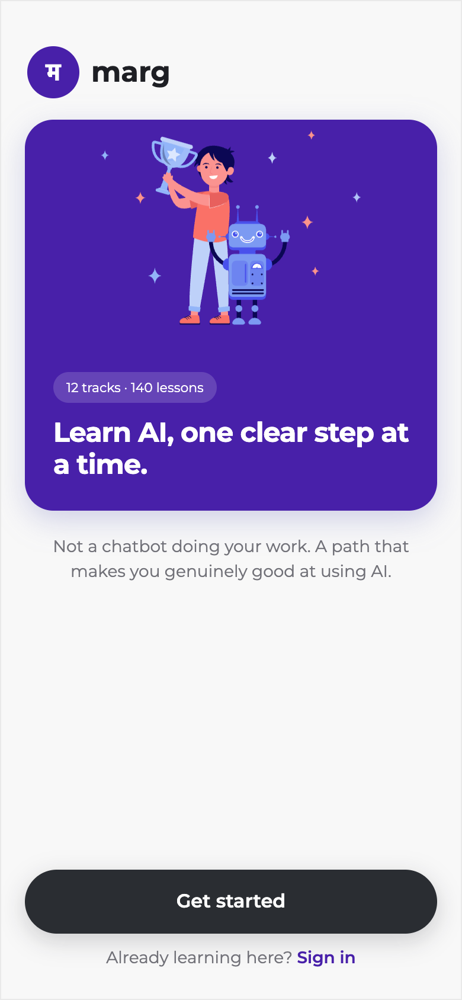

# Marg

**Practical AI skills for non-technical professionals: short daily lessons, then real workplace tasks to practise on.**

[Live app →](https://marg-blond.vercel.app/)

## The problem

Non-technical professionals are being told to "use AI at work", but most stop at asking a chatbot for one-off answers. Courses teach theory that doesn't transfer to their job, and a chatbot that does the work for you teaches you nothing. What's missing is a structured path that builds a skill you can repeat, using the kind of tasks you actually face at work.

## What it does

- **A short assessment first.** Three questions place the learner on a path that suits them before any curriculum appears.
- **One module per week.** Monday to Friday is a ten-minute lesson each day: a hook, the idea, a worked example, a small action and a quiz. Saturday is a build task on a realistic work scenario, and Sunday applies the same skill to a new one.
- **Modules built around real work:** how software works, directing AI rather than asking it, turning customer feedback into evidence, prioritising feature requests, writing product updates, and prototyping with AI.
- **Duels:** a five-question head-to-head quiz on modules the learner has reached, with wins, streaks and rank.
- **Progress tracking** across lessons, modules and courses.

## Key product decisions

- **Assess before showing the curriculum.** The path is personalised first, so a beginner and a confident user don't start in the same place.
- **Practice over chat.** Every week ends with work-style tasks, not a conversation with a bot. The landing page puts it plainly: "Not a chatbot doing your work."
- **Duels against a bot, not live players, for now.** Live matchmaking needs enough people online to work, and faking "12 online" would be dishonest. Wins and rank are real, calculated on the server, and points are never trusted from the browser.
- **No invented social proof.** No testimonials or results claims appear until there is real evidence to show.

## Results & evidence

<!-- TODO(Rochak): confirm the user count before publishing (your profile README says "around 100 people have used it"). -->
- Used by around 100 people.
- Module completion and in-app feedback are tracked with PostHog, to see where learners drop off.

## Scope & limits

- **Labs and role-specific learning paths are not live yet.**
- **No team or employer accounts, and no payments.**
- **Daily reminder emails are not sent yet.** The preference exists, but delivery and unsubscribe still need building.
- **Duels are against a bot only.**

## Next in roadmap

- Role-specific learning paths.
- Live duels against other learners.
- Labs for open-ended practice.
- Daily nudges by email, with unsubscribe.

<strong>Tech stack</strong>

Next.js (App Router), TypeScript, Supabase (Auth, Postgres, Row Level Security), PostHog, Vitest and Playwright, deployed on Vercel. Installable as a home-screen web app.

